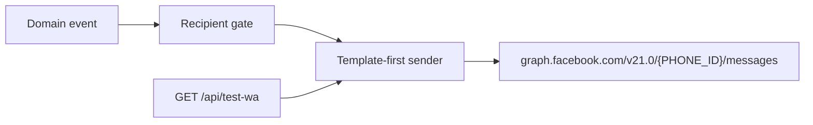

# WhatsApp Cloud API — Technical Handover

Portable reference for reimplementing the Meta WhatsApp outbound notification pattern used in **mv-inventory**. Domain events (purchase orders / requisitions) are examples only; the client and ops model apply to any app.

**Source in this repo**

| Piece | Path |
|-------|------|
| Cloud API client | `src/lib/whatsapp.ts` |
| Event triggers | `src/app/api/state/route.ts` |
| Smoke test | `src/app/api/test-wa/route.ts` |
| Recipient fields | `src/lib/types.ts` (`User.phone`, `RolePermissions.receiveNotifications`) |

---

## 1. Overview

- **Outbound only** via Meta WhatsApp Cloud API (Graph API `v21.0`).
- **No** inbound message webhooks, delivery/read receipts, or send queue in this implementation.
- Production sends are **template-first** (business-initiated). Free-form text is optional fallback and only works inside the **24-hour customer-care window**.
- Sends are **fire-and-forget** after the domain write succeeds; WhatsApp failure does not roll back app state.
- A Graph `messageId` means Meta **accepted** the request, not that the phone delivered the message.

---

## 2. Architecture



1. Something changes in domain state (or a test route is hit).
2. Eligible recipients are filtered (`canWA`-style gate).
3. Client tries approved template name(s) × language(s), then optional text.
4. Single HTTP POST to Graph with Bearer token + Phone Number ID.

---

## 3. Meta prerequisites (ops)

| Requirement | Notes |
|-------------|--------|
| WhatsApp Business Account (WABA) | Live mode for real recipients |
| Payment method on the WABA | Missing/failing payment → account **Restricted**; outbound templates fail or do not deliver |
| Meta app + system user token | Needs `whatsapp_business_messaging` (management scopes useful for templates) |
| **Phone Number ID** | Numeric ID from API Setup — **not** the display E.164 (`+233 …`) |
| Approved message templates | Name + language code must match Meta exactly |
| Development mode | Recipients must be on the Meta “test numbers” allowlist |
| Live mode | Business-initiated template messages allowed (subject to billing / quality) |

**Verified working shape (this project):** system-user token, phone `account_mode: LIVE`, quality often `GREEN`, display name approved (e.g. “Maya Villa Hotel”).

---

## 4. Environment variables

| Name | Required | Purpose |
|------|----------|---------|
| `META_WA_TOKEN` | Yes | Bearer access token |
| `META_WA_PHONE_ID` | Yes | Sending phone number ID |
| `META_WA_TEMPLATE_LANGS` | No | Comma-separated language codes; default `en_US`, `en_GB`, `en` |

If token or phone ID is missing, the client returns `{ ok: false, errorMessage: "META_WA_TOKEN or META_WA_PHONE_ID missing" }` (callers still invoke helpers; nothing is sent).

### Current Maya Villa API details

| Field | Value |
|-------|--------|
| Graph API version | `v21.0` |
| Messages URL | `https://graph.facebook.com/v21.0/941900499011030/messages` |
| Business display number | `+233 20 623 3149` (Maya Villa Hotel) |
| `META_WA_PHONE_ID` | `941900499011030` |
| `META_WA_TOKEN` | **Not stored in this doc** — copy from local `.env.local` (or Meta Developer Console → App → WhatsApp → API Setup / system user token). Never commit the raw token. |

Example `.env` for another app:

```env
META_WA_TOKEN=<paste system-user token from .env.local or Meta>
META_WA_PHONE_ID=941900499011030
# optional:
# META_WA_TEMPLATE_LANGS=en_US,en_GB,en
```

Auth header on every send:

```http
Authorization: Bearer <META_WA_TOKEN>
```

---

## 5. Portable API surface

Copy/adapt `src/lib/whatsapp.ts`. All sends go through one POST helper.

### Endpoint

```
POST https://graph.facebook.com/v21.0/{META_WA_PHONE_ID}/messages
Authorization: Bearer {META_WA_TOKEN}
Content-Type: application/json
```

### Phone normalization

Strip non-digits before `to` (e.g. `+233 24 123 4567` → `233241234567`).

### Result shape

```ts
type SendAttemptResult = {
  ok: boolean;
  status?: number;
  errorCode?: number;
  errorMessage?: string;
  messageId?: string; // Meta accepted — not delivery proof
};
```

### Functions

| Function | Behavior |
|----------|----------|
| `sendWhatsApp(to, body)` | Free-form text; 24h window only |
| `sendWhatsAppTemplate(to, name, bodyParams[], language?)` | Named template + positional body params |
| `sendWhatsAppTemplateFirst(to, names[], params[], textFallback?)` | Each name × each language; then optional text |
| `sendWhatsAppManyTemplateFirst(phones[], …)` | Same, parallel per recipient (skips null/empty) |

Unused in production (still in file): text-first helpers (`sendWhatsAppWithTemplateFallback` / `Many…`) that fall back to templates on error **131047**.

### Minimal Graph bodies

**Text**

```json
{
  "messaging_product": "whatsapp",
  "to": "233241234567",
  "type": "text",
  "text": { "body": "Hello" }
}
```

**Template (body parameters)**

```json
{
  "messaging_product": "whatsapp",
  "to": "233241234567",
  "type": "template",
  "template": {
    "name": "mmv_po_pending_approval",
    "language": { "code": "en_US" },
    "components": [
      {
        "type": "body",
        "parameters": [
          { "type": "text", "text": "PO-001" },
          { "type": "text", "text": "alice" }
        ]
      }
    ]
  }
}
```

Body `parameters` are **positional** and must match the approved template placeholders in order and count.

---

## 6. Recipient eligibility pattern

Reuse this gate in any app:

```ts
const canWA = (u) =>
  u.active &&
  !!u.phone &&
  (u.role === "admin" ||
    (rolePermissions[u.role]?.receiveNotifications ?? false));
```

- Store phones in international form (UI hint: `+233…`).
- Admins bypass the role flag if they have a phone.
- Non-admin roles need `receiveNotifications: true` **and** any action-specific permission (e.g. `approvePO`) used when selecting who to notify.

In this inventory seed, `inventory_manager` and `accountant` default `receiveNotifications: false` — they will not get WhatsApp until that preference is enabled.

---

## 7. Template strategy and Meta quirks

### Strategy used here

- Prefer **exact approved** template names from Meta.
- This app keeps **candidate lists** (prefix / truncation variants) because Meta UI and API naming drifted historically:
  - Prefixes tried: `mmv_` → `mvm_` → `nvm_` → `mv_`
  - Some names truncated in Meta (e.g. `…_revie`, `…_con`, `…_noti`) plus full forms
- Production path: try candidates × `META_WA_TEMPLATE_LANGS` (or defaults), stop on first success, then optional text fallback.

For a **new** app: register one canonical name per event and drop the candidate matrix unless you inherit an existing WABA with ambiguous names.

### Common error codes

| Code | Meaning |
|------|---------|
| **132001** | Template name/language not found (`mv_*` historically failed here; `mmv_*` worked) |
| **131047** | Outside 24h customer-care window (free text blocked) |

### Billing / delivery

- Unpaid or failing card → WABA **Restricted**; notifications stop.
- Clearing balance and a working default payment method restores outbound messaging.
- Prefer monitoring payment status in Meta Business Suite; do not assume `messageId` = delivered.

---

## 8. Event wiring (mv-inventory example)

Pattern: on `POST /api/state`, diff previous DB state vs incoming payload, enqueue WA (and web push) promises, then `saveStateToDb`, then `void Promise.all(waPromises)`.

| Trigger | Recipients | Template candidates (key) | Body params |
|---------|------------|---------------------------|-------------|
| New PO `PendingApproval` | Users with `approvePO` (or admin) who pass `canWA` | `*_po_pending_approval` | PO number, creator username |
| PO → `Approved` | Creator | `*_po_approved` | PO number, approver |
| PO → `Received` | Users with `accountantApprovePO` (or admin) | `*_po_received_price_revie` / `*_review` | PO number |
| `accountantApproved` true | Approving accountant + other PO approvers | `*_po_price_approved_con` / `*_confirm`; `*_noti` / `*_notify` | PO number; PO number + accountant |
| New Req `PendingApproval` | Users with `approveRequisition` (or admin) | `*_req_pending_approval` | department, creator |
| Req → `Approved` | Requester | `*_req_approved` / `*_approve` | department, approver |
| Req → `Rejected` | Requester | `*_req_rejected` | department |

Not used for: stock levels, bookings, generic inventory alerts.

---

## 9. Smoke test recipe

### Endpoint (this repo)

```
GET /api/test-wa?to=<digits>&mode=template|text|both
```

- Default `mode=template`.
- Tries `mmv_po_pending_approval` (then other prefixes) with params `["TEST-PO-001", "Maya Villa Test"]`.
- Returns `attempts[]` with `ok`, `messageId`, `error`, `errorCode`.
- **Currently unauthenticated** — secure or remove when porting.

### Checklist

1. `META_WA_*` set on the running host  
2. Token valid; phone LIVE / healthy quality  
3. Template send returns `ok` + `messageId`  
4. Message appears under the **business display name** on the phone  
5. Users who should be notified have `phone` set  
6. Non-admins have `receiveNotifications` enabled for their role  

### Delivery hints if Meta accepts but phone shows nothing

1. Dev mode: add number to Meta recipient allowlist  
2. For text mode: user must have messaged the business within 24h  
3. Check chat from business name (not personal), Archived / Message requests  
4. Prefer template mode for production-like tests  

---

## 10. Porting checklist (another application)

1. Create or reuse Meta app + WABA; attach a working payment method; go Live when ready.  
2. Approve one template per notification type (name, language, placeholder count).  
3. Set `META_WA_TOKEN` and `META_WA_PHONE_ID` (optional `META_WA_TEMPLATE_LANGS`) on the host.  
4. Copy/adapt `whatsapp.ts` (normalize phone, template-first, structured results, logging).  
5. Persist user phones + a notification permission (role or per-user).  
6. From domain events, select recipients, call `sendWhatsAppManyTemplateFirst` / `TemplateFirst` **without blocking** the primary write.  
7. Add an **authenticated** smoke-test route (do not ship open `GET /api/test-wa`).  
8. Treat webhooks / delivery status as optional future work — this design does not require them.  

---

## Out of scope in this implementation

- Inbound WhatsApp / chatbot flows  
- Webhook signature verification or status callbacks  
- Persistent send log / retry queue  
- Multi-WABA routing in code (ops concern if several Meta apps share one WABA — use the token and Phone Number ID that own the templates you call)
